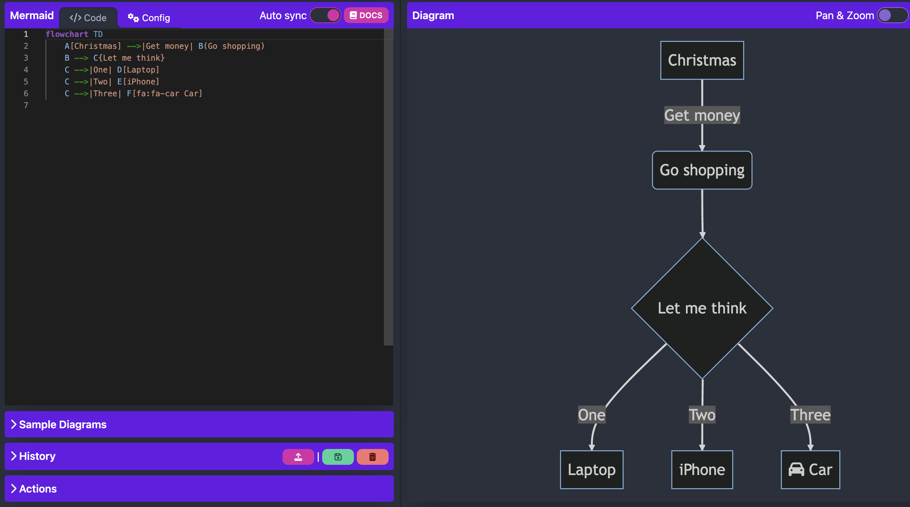
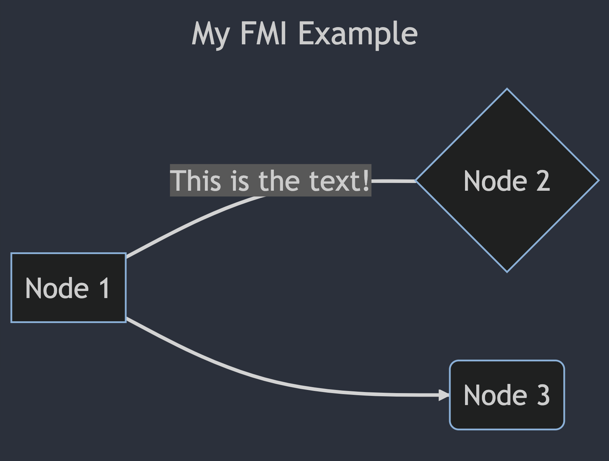

# Задача 4 | Метапрограмиране

## Задача 1 - Валидатор

Задачата е да имплементирате модул `Validator.Struct`, който:
- се използва в модули, които дефинират структура.
- Дефинира макрос `__using__/1`, така че да може да се използва `use Validator.Struct`.
- Добавя макрос `validation/2` в извикващия модул. Този макрос се използва в тялото на модула, за да дефинира валидация. Приема два аргумента - име на поле от структурата и описание на валидация.
- Добавя функция `valid?/1` в извикващия модул, която приема като единствен аргумент структура от същия модул и изпълнява валидациите, дефинирани в модула. Ако дори една валидация не успее, връща `false`. В противен случай връща `true`.
- Добавя в модула функция `validate/1`, която приема като единствен аргумент структура от същия модул и изпълнява валидациите, дефинирани в модула. Връща `:ok` или `{:error, Keyword.t}`. Когато има грешки, връща keyword списък, в който ключът е името на полето, а стойността е грешката. Едно поле може да има много валидации, които не успяват. В такъв случай списъкът съдържа по една ключ-стойност двойка за всяка провалена валидация.

Пример:

```elixir
defmodule User do
  use Validator.Struct
  defstruct ~w[id name email]a

  @external_resource path = Path.join(__DIR__, "forbidden_names.txt")
  @forbidden_names File.stream!(path, [], :line) |> Enum.map(&String.trim/1)

  validation(:email, type: :binary)
  validation(:name, type: :binary)
  validation(:name, excludes: @forbidden_names)
  validation(:name, length: 4..20)
  validation(:email, :valid_email)
  validation(:email, length: 5..50)
  validation(:name, &not_abusive/3)

  defp not_abusive(_struct, _field, _value) do
    # Run some dictionary/ML model algorithm to check if the username
    # contains swear or abusive words. If it does, return
    # {:error, "The name contains banned words."}
    :ok
  end
end
```

```elixir
# Invalid user
user = %User{id: 1, name: "iva", email: "not"}

User.valid?(user)
false

User.validate(user)
{:error,
 [
  email: "The value is not a valid email. Got 'not' instead.",
  email: "The length must be bettween 5 and 50. Got a value of length 3 instead.",
  name: "The length must be bettween 4 and 20. Got a value of length 3 instead.",
 ]
}
# Valid user
user2 = %User{id: 2, name: "Gosho", email: "gosho@example.com"}

User.valid?(user2)
true

User.validate(user2)
:ok
```

#### Изпълнение на валидации

- За всяко поле първо се изпълнява `:type` валидацията, ако съществува. Ако тя се провали, то нито една от другите валидации за това поле няма да се изпълни. Причинта за това е, че ако едно поле не е от очаквания тип, то останалите валидации за него няма как да бъдат изпълнени.
- Ако `:type` валидацията успее, то се изпълняват **всички** останали валидации за това поле, за да може всички грешки да бъдат събрани и върнати на потребителя.

#### Поддържани валидации

Дефиницията на една валидация изглежда по следния начин:
`validation(:field_in_struct, validation_name: validation_arg)`


##### type
Приема като аргумент един от атомите `:binary`, `:integer`, `:float`, `:number`, `:atom`, `:list`, `:tuple`, `:map` (ако искате, добавете и останалите типове като референция, pid, port и т.н.). Hint: Няма вградена функция, която приема аргумент и връща неговия тип.

Пример: `validation(:name, type: :binary)`

##### excludes

Приема като аргумент тип, който имплементира `Enumerable` протокола. Проваля се, ако стойността на полето е измежду подадените стойности. 

Пример: `validation(:name, excludes: ["admin", "moderator"])`

##### length

Работи за списъци и низове. Приема като аргумент `Range`. Границите са ексклузивни - `length: 1..3` позволява полета с дължина 1, 2 и 3, но не 0, 4, 5 и т.н.

Пример: `validation(:name, length: 4..20)`

##### valid_email

Прави много базова проверка дали едно поле е `email`. В тестовете, ако един низ съдържа `@` и непразни низове около него, приемаме, че е валиден email.

Пример: `validation(:email, :valid_email)`

##### Anonymous function

Ако проверката, която трябва да се направи, е по-специфична и не се покрива от базовите валидации, то може да се подаде анонимна функция на три аргумента, която връща `:ok` или `{:error, String.t()}`. Анонимната функция приема 3 аргумента - структурата, името на полето и стойността на полето.

Пример: 
```elixir
validation(:name, fn _struct, _field, value -> 
  case String.contains?(value, "admin") do
    false -> :ok
    true -> {:error, "Cannot contain 'admin' in the name"}
  end
end)
```

#### Поведение при грешки

При грешка всяка валидация връща низ, който съдържа в себе си катo подниз (виж примера в началото на условието):
- `:valid_email` - `"value is not a valid email"`
- `:length` - `"length must be between <lower> and <upper>"`
- `:type` - `"type must be <type>, got <arg type> instead"`. Hint: *Няма* функция, която по даден терм връща неговия тип. Внимавайте да не използвате функция, която работи само в `iex`.
- `:excludes` - `"value is not allowed"`
- Всяка анонимна функция сама дефинира текста на своята грешка.

В тестовете ще проверяваме за наличието на тези поднизове. За удобство на потребителите добавете допълнителна информация към грешката относно получения аргумент. Може да добавите дължината на аргумента, неговата стойност и т.н.

## Задача 2 - Русалка

[MermaidJS](https://mermaid.js.org/) е инструмент за чертаене на диаграми, описани в [markdown](https://www.markdownguide.org/) формат.


ExDoc инструментът за документация в Elixir поддържа MermaidJS диаграми.

Поради възможността за генериране на много валидни и еквивалентни markdown диаграми тази задача идва заедно със своите тестове. Предоставени са всички тестове, с които ще тестваме вашата програма. Останалата част от точките ще зависят от добрия стил на програмиране.

Задачата е да имплементирате Elixir DSL, който се превежда до markdown, който може да бъде визуализиран. Ще бъде имплементирана само една малка част от функционалността на MermaidJS за `flowchart` типа диаграма.

Трябва да имплементирате макрос `to_md` в `Mermaid` модула, който приема `do` блок и връща низ, който съдържа markdown, който описва същата диаграма (вижте тестовете).

Пример:
```elixir
Mermaid.to_md do
  type Flowchart
  direction LR
  title "My FMI Example"
  A[name: "Node 1", shape: :oval] -- "This is a link" -- B[name: "Node 2", shape: :oval]
  A ~>> C[name: "Node 3", shape: :oval]
end
```
Ще се преведе до:
```markdown
---
title: My FMI Example
---
flowchart LR
A[Node 1] --- |This is the text!| B{Node 2}
A --> C(Node 3)
```
Валиден алтернативен синтаксис за линкове е също и този:
```markdown
---
title: My FMI Example
---
flowchart LR
A[Node 1]-- This is the text! ---B{Node 2}
A --> C(Node 3)
```
И двата примера се визуализират по следния начин (линк към [live editor](https://mermaid.live/edit#pako:eNodjb0KwkAQhF9l3UrBFGp3heAvCMZC7TyLJdmYYO4SLhuMxLy7S2CKYeYbpsekShkNRlFkvRRSsoH4C8f4BIeOXF2y9WOXldUnySkInK_Wbx4X3cHiCVr-7nnRgEpyBuFOJj_Y9iOwHJRVZg276RisZjhHx8FRkeptbz2ARR06tmjUphTeFq0flKNWqtvXJ2gktDzHtk5JeF_QK5BDk1HZ8PAH7BA_dw)):


В тестовете се използва първият синтаксис: `A[Node 1] --- |This is a link| B{Node 2}`.

### Изисквания

Ще трябва да имплементирате следните неща:

- Дефиниция на тип на диаграмата чрез `type <ModuleName>`. Изисква се поддържка само на `type Flowchart`. Задължително поле.
- Дефиниция на посока чрез `direction <ModuleName>`. Поддържани посоки са `LR`, `RL`, `TB` и `BT` (тоест `LeftToRight`, `RightToLeft` и т.н.). Ако не е зададена посока, използва `TB` по подразбиране.
- Дефиниция на връх. Един връх се дефинира като `Name[<keyword list>]`. `Name` е име на модул, a keyword list има ключове `:text` и `:shape`. `:shape` e `:rectangle`, `:rhombus` или `:oval`. Ако `:shape` не e посочен, по подразбиране се използва `:rectangle`. `:text` е произволен текстов низ, който ще бъде изписан вътре във върха (виж изображенията).
- Дефиниция на ненасочена връзка без текст: `A[text: "a"] -- B[text: "b"]`
- Дефиниция на ненасочена връзка с текст: `A[text: "a"] -- [link_text: "text"] -- B[text: "b"]`
- Дефиниция на насочена връзка без текст: `A[text: "a"] ~>> B[text: "b"]`
- Дефиниция на насочена връзка с текст: `A[text: "a"} ~>> [link_text: "text"} ~>> B[text: "b"}`
- Използване на псевдоним за връх. Ако някой връх е вече дефиниран чрез `Name[<keyword list>]`, то само срещането на `Name` e валиден връх:
  ```elixir
  Mermaid.to_md do
    direction LeftToRight
    A[text: "Node 1", shape: :oval] -- B[text: "Node 2", shape: :oval]
    A ~>> [link_text: "text"] ~>> C[text: "Node 3"]
  end
  ```

### Забележки

В Mermaid дължината на връзките се настройва, като се добавят допълнителни `-` към нея.
Например `---` е "къса" връзка, `----` e по-дълга връзка, `-----` e още по-дълга връзка и т.н.
Същото важи и за насочените връзки.
Във вашата имплементация използвайте най-късите връзки: `---` и `-->`

Дефинициите на върхове използват имена на модули `MyNode[text: "Node 1"]`, но това не значи, че `MyNode` е име на съществуващ модул. Въпреки че изглежда като модул, то `MyNode` никога не е използван като такъв, т.е. не се извикват никвакви функции от него. Единствената причина да се използват имена на модули тук е за по-голяма визуална близост до markdown репрезентацията на диаграмите.